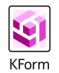

# Community

Join us in this jurney to build the power of 'KRM as code or data' to Kubernetes. We are happy to help and
would like to learn your user stories in [the Kubenet discord server](https://discord.gg/fH35bmcTU9).

Kform was started and currently maintained by Nokia with the clear target to make the project community driven.

## Kubenet

If you are intrested in a biger picture about how do we imagine network manegement in a Kubernetes native way check out
[Kubenet](https://learn.kubenet.dev/). 

## Logos

Logos of Kform in different formats:

* [With name 100x123 png](../assets/logos/Kform-transparent-withname-100x123.png)
* [With name 503x690 png](../assets/logos/KForm-transparent-withname-447x676.png)
* [Without name 100x100 png](../assets/logos/KForm-transparent-noname-96x96.png)
* [With name svg](../assets/logos/Kform-logo.svg)
* [Without name svg](../assets/logos/Kform-logo-square.svg)

---
